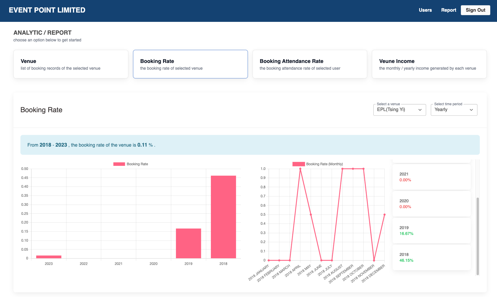
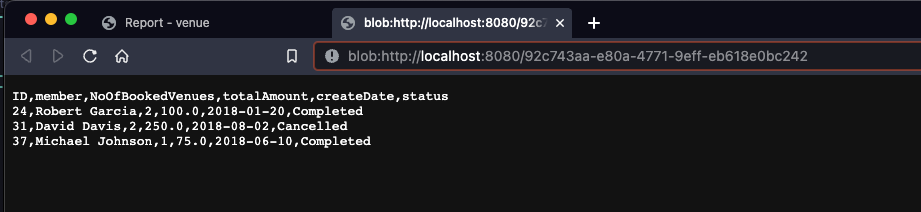

# ITP4511 - Enterprise Systems Development

## Background

EPL operates five venues in Hong Kong, providing rental venue services to its members for event organization. The current booking process is done in person or by phone reservation, with records manually recorded in a notebook. This method is error-prone and inefficient for senior management to assess the utilization rate of each venue and booking attendance of each member. EPL is looking for IT consultants to digitalize the system to improve efficiency, real-time record verification, and generate statistical reports.

## Features

### Venue Booking

- Show a list of venue and related features (e.g. Image, name, type, capacity, location, description, person-in-charge, booking fee)

    

- Send booking request / check booking request status

    

    

    
    

- Booking reminder

    

- Check/ Update personal booking record

    

### Venue and Guest List Management

- Venue CURD

    

    

    

    

- Guest CURD

    

    
    (add guests who added by user before but not in the guest list)

    

    

    

- Confirm/decline booking request

    

### Analytic / Report

- Show a list of booking records of the selected venue

    

- Show the booking rate of selected venue (calculated by month/year)

    

- Show the booking attendance rate of selected user (calculated by month/year)

    

- Show the monthly/ yearly income generated by each venue

    

### Account Management

- User CURD

    

    

### Extra Feature

- Keywords/ Tags search to find suitable venue / guest
- Export the overall booking records to Excel or CSV file (.xls / .csv)

    

    

